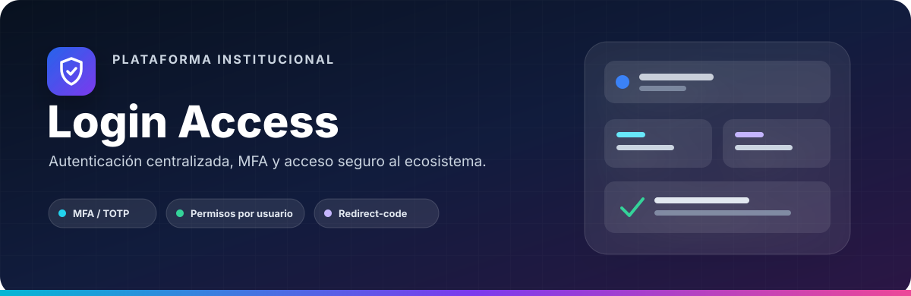
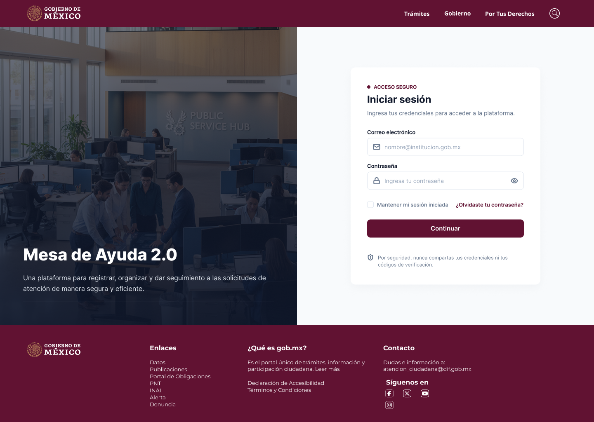
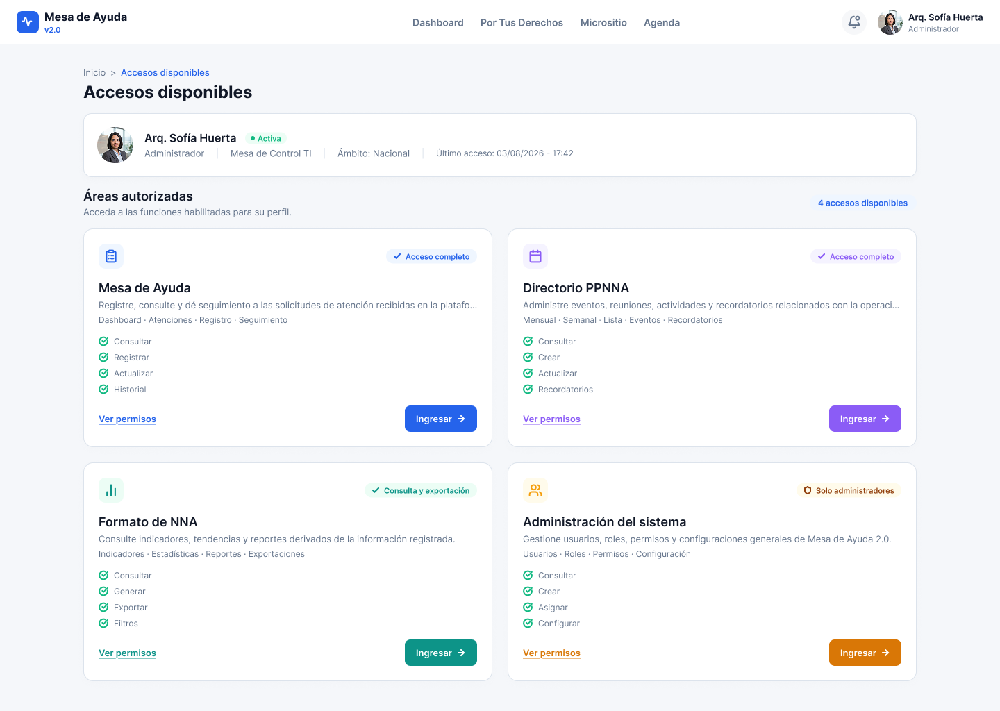
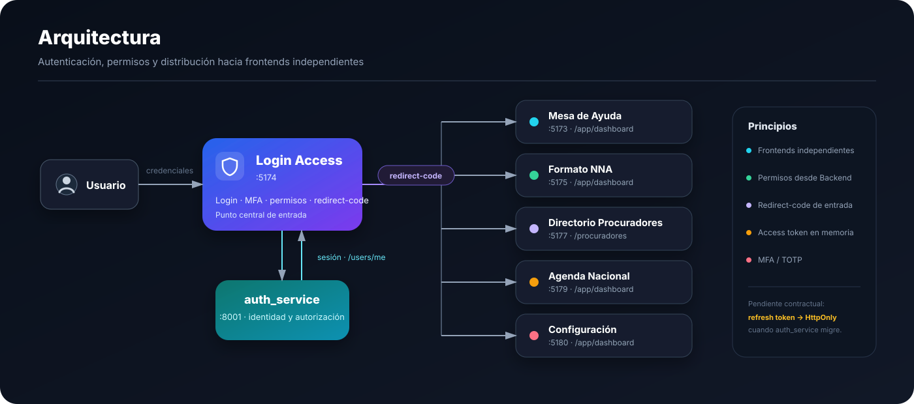
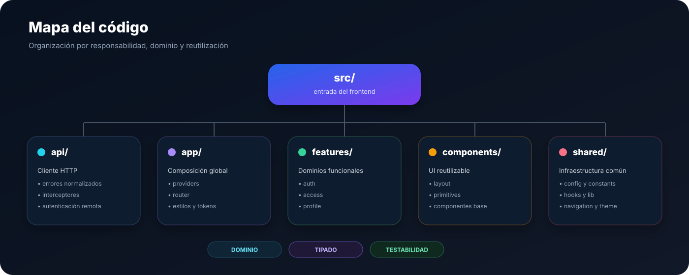

<a id="top"></a>

<div align="center">



<br />

<p>
  <strong>Frontend central de autenticación y distribución de accesos del Ecosistema Integral DGCP.</strong>
</p>

<p>
  Login · MFA/TOTP · recuperación de acceso · sesión · permisos · redirección segura
</p>

<p>
  
  
  
  
</p>

<p>
  <a href="https://www.figma.com/design/ZPiqqx5Ml36Nmj5sz2Z6o6/Login-Access?node-id=0-1&t=Xhj2g0gqPsS7Qqtr-1">
    
  </a>
  
  
</p>

<p>
  <a href="#-vista-previa"><strong>Vista previa</strong></a>
  ·
  <a href="#-diseño-en-figma"><strong>Figma</strong></a>
  ·
  <a href="#️-arquitectura"><strong>Arquitectura</strong></a>
  ·
  <a href="#-stack-tecnológico"><strong>Stack</strong></a>
</p>

</div>

---

## ✨ Descripción

**Login Access** es el punto de entrada autenticado del **Ecosistema Integral DGCP**.

Centraliza la validación de identidad, MFA y permisos antes de mostrar al usuario los
módulos que tiene autorizados. Cada módulo operativo continúa siendo un frontend
independiente; Login Access se ocupa de la autenticación y de entregar un
`redirect-code` hacia el destino seleccionado.

<table>
<tr>
<td width="33%" align="center" valign="top">

### 🔐 Identidad

Login, activación, recuperación y restablecimiento de contraseña.

</td>
<td width="33%" align="center" valign="top">

### 🛡️ Seguridad

MFA/TOTP, inactividad, sesión y cierre sincronizado.

</td>
<td width="33%" align="center" valign="top">

### 🧭 Accesos

Permisos por usuario y redirección a frontends autorizados.

</td>
</tr>
</table>

---

## 🖼️ Vista previa

<table>
  <tr>
    <td align="center"><strong>Inicio de sesión</strong></td>
    <td align="center"><strong>Accesos disponibles</strong></td>
  </tr>
  <tr>
    <td width="50%">
      
    </td>
    <td width="50%">
      
    </td>
  </tr>
</table>

<p align="center">
  <sub>
    Flujo de autenticación y distribución de accesos. Los datos representados en las
    interfaces son demostrativos.
  </sub>
</p>

---

## 🎨 Diseño en Figma

El archivo de **Login Access** funciona como referencia visual y funcional del producto,
incluyendo estados normales, errores, seguridad y accesos.

<p align="center">
  <a href="https://www.figma.com/design/ZPiqqx5Ml36Nmj5sz2Z6o6/Login-Access?node-id=0-1&t=Xhj2g0gqPsS7Qqtr-1">
    
  </a>
</p>

<table>
<tr>
<td width="33%" valign="top">

**Login**

- acceso normal;
- campos vacíos;
- credenciales incorrectas;
- cuenta bloqueada;
- sesión expirada;
- error de conexión;
- loading.

</td>
<td width="33%" valign="top">

**MFA**

- configuración TOTP;
- código QR;
- verificación;
- código inválido;
- estados de seguridad.

</td>
<td width="33%" valign="top">

**Accesos**

- módulos autorizados;
- loading / skeleton;
- ausencia de permisos;
- error de carga;
- detalle de permisos;
- logout;
- toasts.

</td>
</tr>
</table>

> Figma define la referencia de producto. La implementación mantiene componentes,
> design tokens y reglas técnicas propias del frontend.

---

## 🏗️ Arquitectura

<p align="center">
  
</p>

<table>
<tr>
<td width="25%" align="center" valign="top">

<strong>01 · IDENTIDAD</strong>

<br /><br />

Usuario inicia sesión y completa MFA cuando corresponde.

</td>
<td width="25%" align="center" valign="top">

<strong>02 · AUTORIZACIÓN</strong>

<br /><br />

<code>auth_service</code> valida identidad, sesión y permisos.

</td>
<td width="25%" align="center" valign="top">

<strong>03 · ACCESOS</strong>

<br /><br />

Login Access presenta únicamente los módulos habilitados.

</td>
<td width="25%" align="center" valign="top">

<strong>04 · HANDOFF</strong>

<br /><br />

Se genera un <code>redirect-code</code> hacia el frontend seleccionado.

</td>
</tr>
</table>

<p align="center">
  
  
  
  
  
</p>

---

## 🧩 Capacidades del producto

<table>
<tr>
<td width="33%" valign="top">

<strong>🔐 Autenticación</strong>

<br /><br />

Login, activación de cuenta, recuperación y restablecimiento de contraseña.

<br /><br />

<code>auth</code> · <code>schemas</code> · <code>guards</code>

</td>
<td width="33%" valign="top">

<strong>🛡️ MFA / TOTP</strong>

<br /><br />

Configuración mediante QR y validación de códigos de seis dígitos.

<br /><br />

<code>setup</code> · <code>verify</code> · <code>OTP</code>

</td>
<td width="33%" valign="top">

<strong>⏱️ Sesión</strong>

<br /><br />

Control de inactividad, access token en memoria y cierre sincronizado.

<br /><br />

<code>session</code> · <code>BroadcastChannel</code>

</td>
</tr>
<tr>
<td width="33%" valign="top">

<strong>🧭 Permisos</strong>

<br /><br />

Consulta de módulos disponibles y acciones autorizadas por usuario.

<br /><br />

<code>accesses</code> · <code>permissions</code>

</td>
<td width="33%" valign="top">

<strong>↗️ Navegación segura</strong>

<br /><br />

Guards, destinos controlados y entrega mediante <code>redirect-code</code>.

<br /><br />

<code>router</code> · <code>redirect</code>

</td>
<td width="33%" valign="top">

<strong>👤 Perfil</strong>

<br /><br />

Información administrativa y estado de seguridad de la cuenta.

<br /><br />

<code>profile</code> · <code>security</code>

</td>
</tr>
</table>

---

## 🛠️ Stack tecnológico

<div align="center">

### Core


<br />
<br />


</div>

<br />

<table>
<tr>
<td width="50%" valign="top">

<strong>⚙️ Estado · Datos · Formularios</strong>

<br /><br />


</td>
<td width="50%" valign="top">

<strong>🎛️ UI · Interacción</strong>

<br /><br />


</td>
</tr>
<tr>
<td width="50%" valign="top">

<strong>🧪 Testing · Calidad</strong>

<br /><br />


</td>
<td width="50%" valign="top">

<strong>🎨 Diseño · Tooling</strong>

<br /><br />


</td>
</tr>
</table>

---

## 🗂️ Arquitectura del código

<p align="center">
  
</p>

<details>
<summary><strong>Explorar estructura técnica</strong></summary>

<br />

```text
src/
├── api/
├── app/
│   ├── providers/
│   ├── router/
│   └── styles/
├── components/
│   ├── layout/
│   └── ui/
├── features/
│   ├── access/
│   ├── auth/
│   └── profile/
├── shared/
│   ├── config/
│   ├── constants/
│   ├── hooks/
│   ├── lib/
│   ├── navigation/
│   └── theme/
└── main.tsx
```

</details>

<p align="center">
  
  
  
  
</p>

---

## 👨‍💻 Autor

<div align="center">

<br />


### Javier Garcia

**Programador Jr · Frontend Developer · UX/UI**

Diseño y desarrollo de interfaces modulares, consistentes y orientadas a producto.

<br />

<a href="https://github.com/Javiergr99">
  
</a>

&nbsp;

<a href="https://www.figma.com/design/ZPiqqx5Ml36Nmj5sz2Z6o6/Login-Access?node-id=0-1&t=Xhj2g0gqPsS7Qqtr-1">
  
</a>

<br />
<br />


<br />
<br />

<a href="#top"><strong>Volver al inicio ↑</strong></a>

</div>
